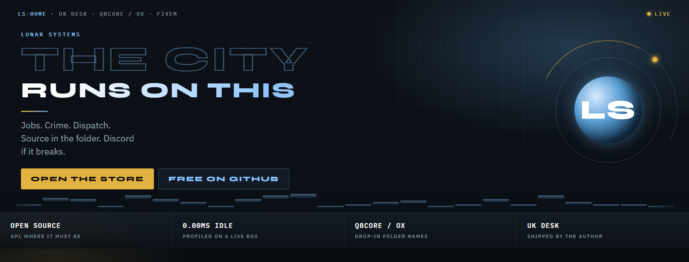
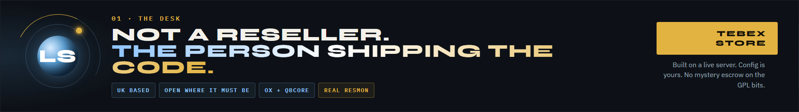
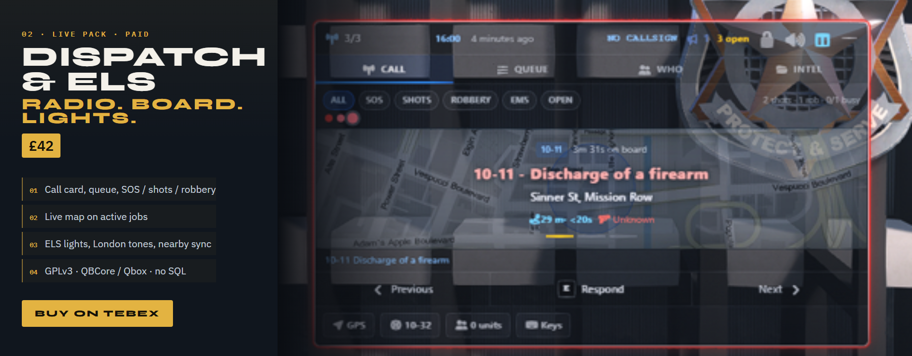
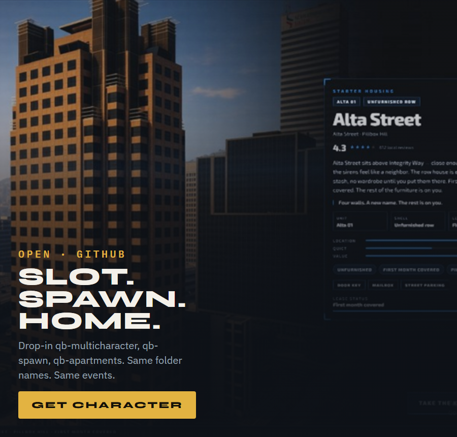
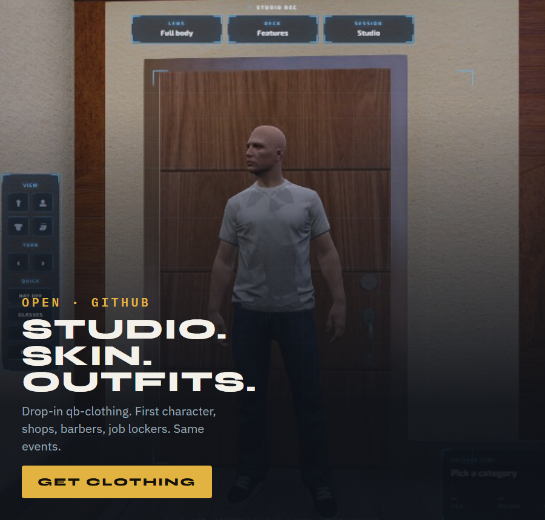
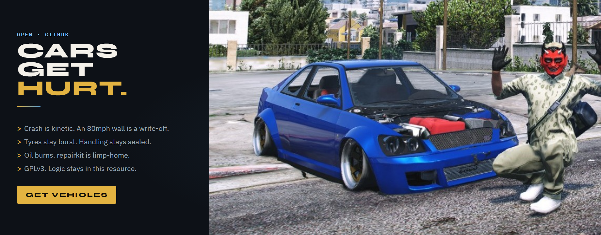
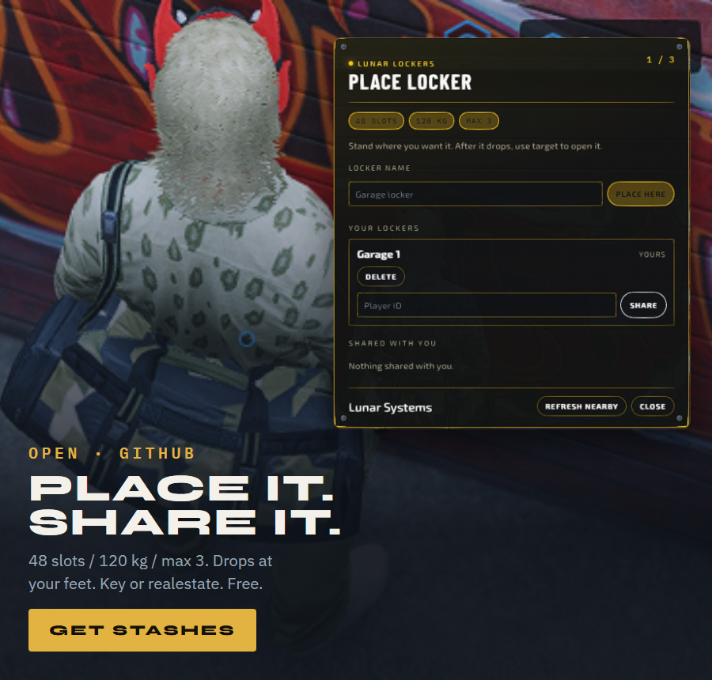
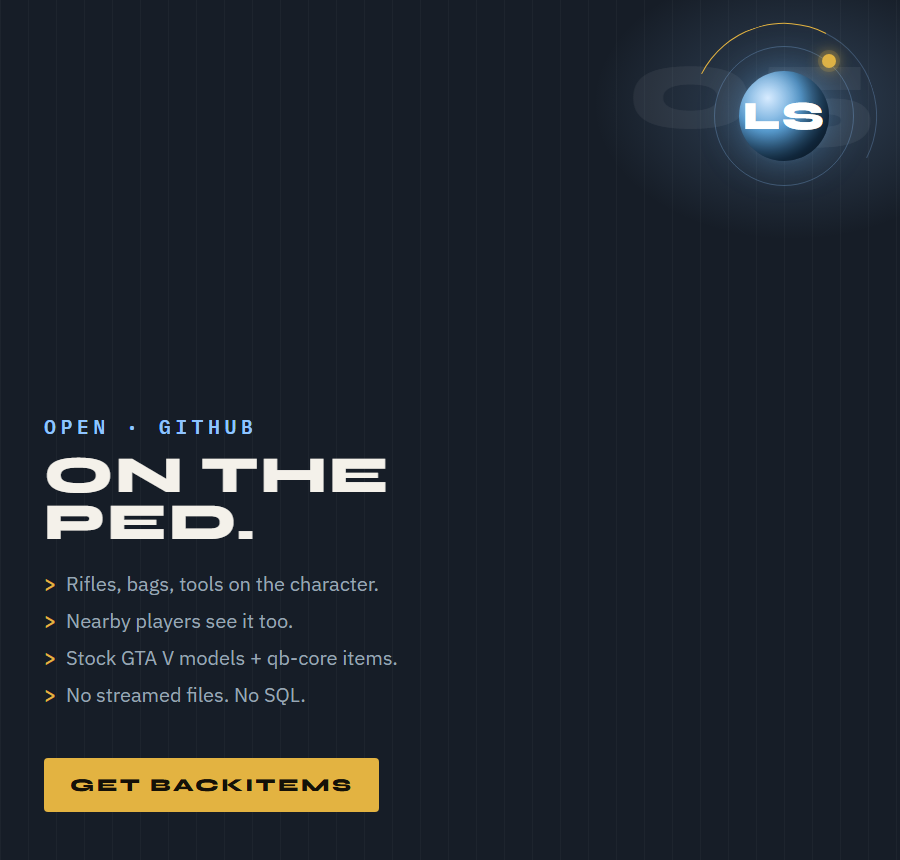
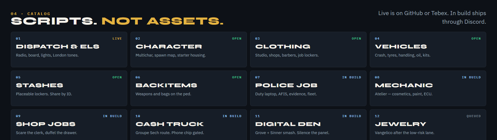
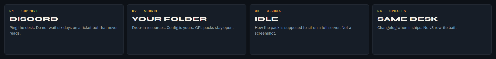

  

  
  &nbsp;
  
  &nbsp;
  
  &nbsp;
  
  &nbsp;
  
  &nbsp;
  
  &nbsp;
  

  

  

<table>
  <tr>
    <td width="50%" valign="top">
      
    </td>
    <td width="50%" valign="top">
      
    </td>
  </tr>
</table>

  

<table>
  <tr>
    <td width="50%" valign="top">
      
    </td>
    <td width="50%" valign="top">
      
    </td>
  </tr>
</table>

  

  

  <a href="https://github.com/LunarSystems-Lab/Lunar-Character">Character</a>
  ·
  <a href="https://github.com/LunarSystems-Lab/Lunar-Clothing">Clothing</a>
  ·
  <a href="https://github.com/LunarSystems-Lab/Lunar-Vehicles">Vehicles</a>
  ·
  <a href="https://github.com/LunarSystems-Lab/Lunar-Stashes">Stashes</a>
  ·
  <a href="https://github.com/LunarSystems-Lab/Lunar-Backitems">Backitems</a>
  ·
  <a href="https://lunarsystems.tebex.store/package/7667448">Dispatch</a>

