

  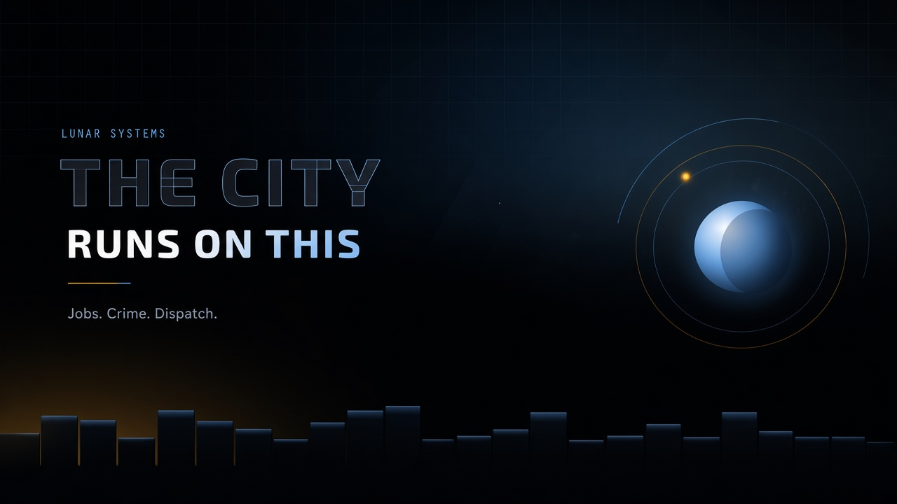

  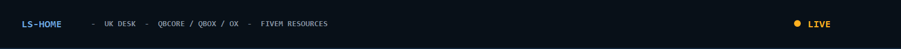

  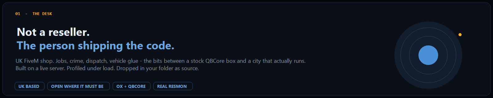

  <a href="https://lunarsystems.tebex.store">
    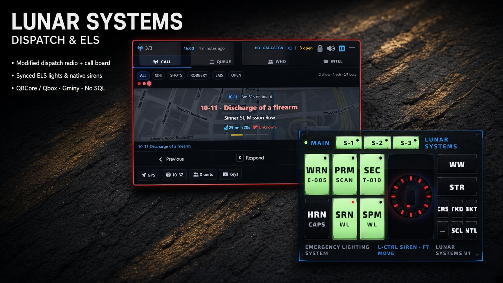
  </a>

  <a href="https://github.com/LunarSystems-Lab/Lunar-Character">
    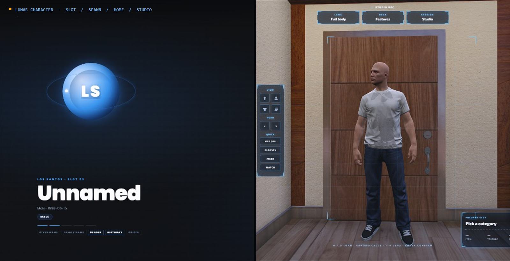
  </a>

  <a href="https://github.com/LunarSystems-Lab/Lunar-Vehicles">
    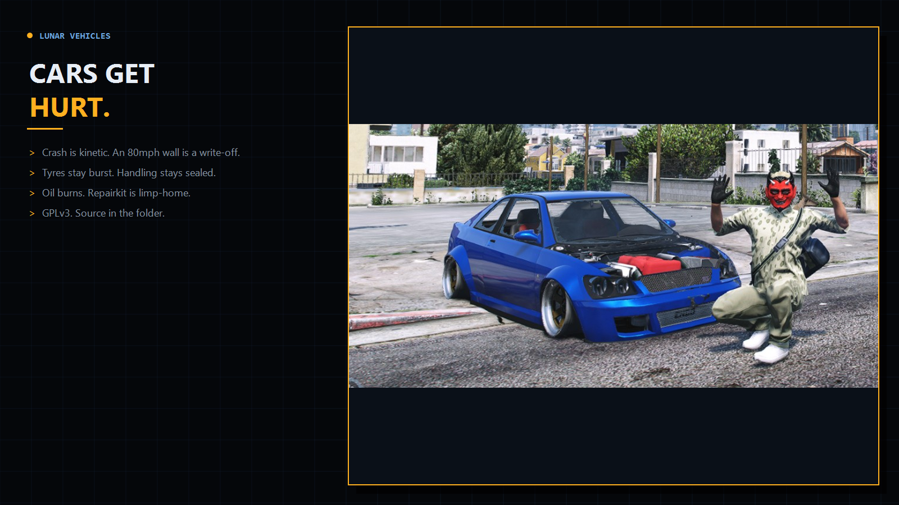
  </a>

  <a href="https://github.com/LunarSystems-Lab/Lunar-Stashes">
    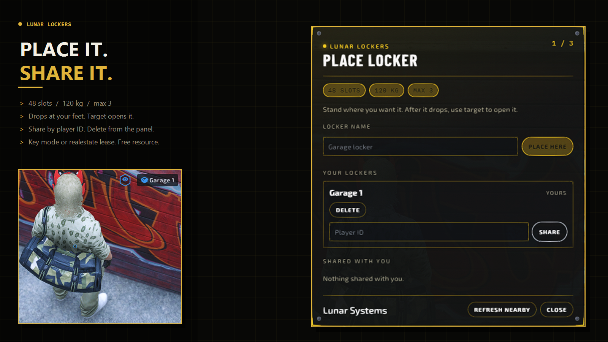
  </a>

  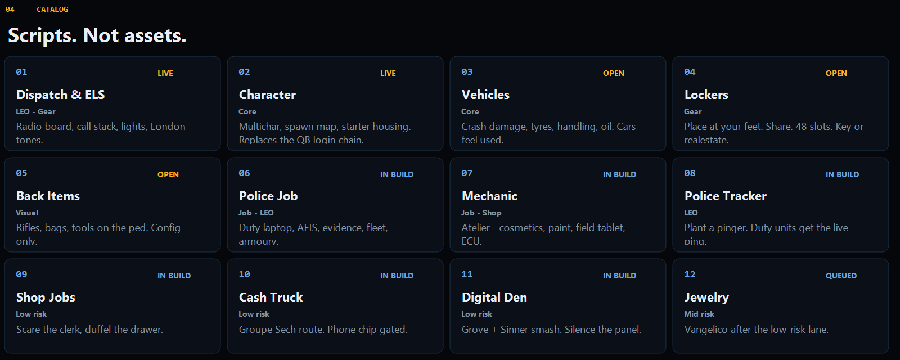

  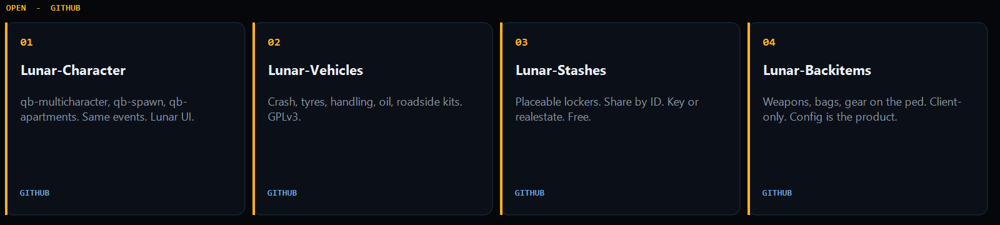

  <a href="https://github.com/LunarSystems-Lab/Lunar-Character">Character</a>
  ·
  <a href="https://github.com/LunarSystems-Lab/Lunar-Vehicles">Vehicles</a>
  ·
  <a href="https://github.com/LunarSystems-Lab/Lunar-Stashes">Stashes</a>
  ·
  <a href="https://github.com/LunarSystems-Lab/Lunar-Backitems">Backitems</a>

  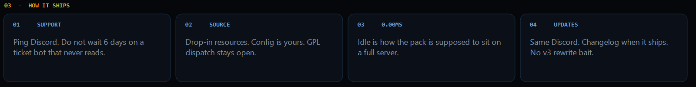

  
  &nbsp;
  
  &nbsp;
  

  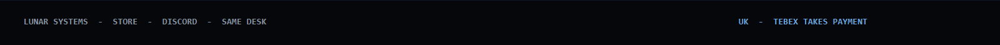

